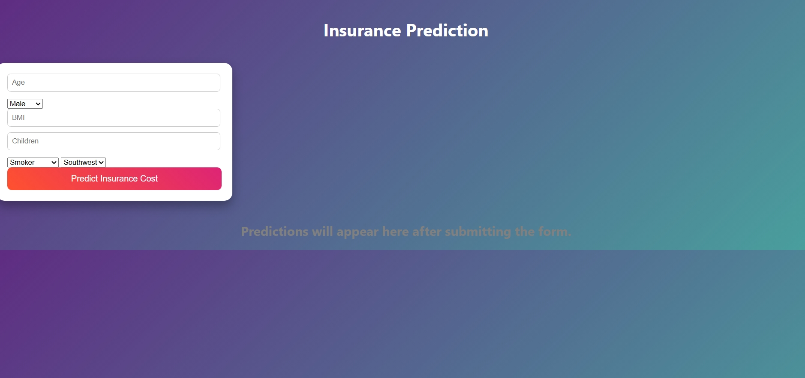
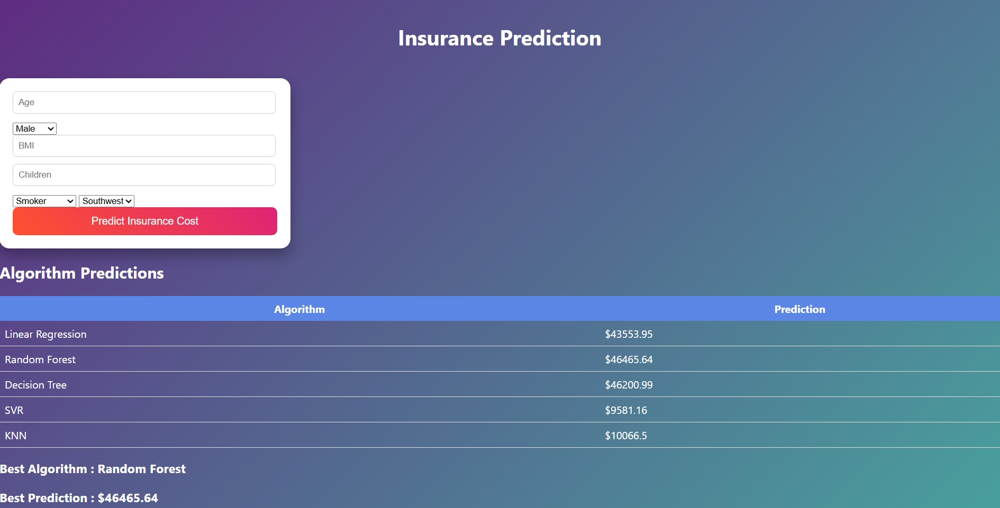

# Insurance Cost Prediction using Machine Learning

## Project Overview
This project is a Machine Learning web application that predicts insurance cost based on user details such as age, BMI, number of children, smoking status, and region.

The system compares multiple machine learning algorithms and displays predictions.

## Technologies Used
- Python
- Machine Learning
- Flask
- HTML
- CSS
- Scikit-learn
- Pandas
- NumPy

## Dataset
The dataset used is the **Insurance dataset**, which contains medical cost information.

## Project Interface

### Before Prediction


### After Prediction


## Files in the Project

- `app.py` – Flask application
- `insurance_model.pkl` – Trained machine learning model
- `insurance.csv` – Dataset used for training
- `index.html` – User interface
- `style.css` – Styling for the UI
- `best_model_name.txt` – Stores the best model name

## How to Run the Project

1. Install required libraries
```
pip install pandas numpy scikit-learn flask
```

2. Run the application
```
python app.py
```

3. Open browser and go to
```
http://127.0.0.1:5000
```

The application will allow users to enter data and predict insurance cost.
